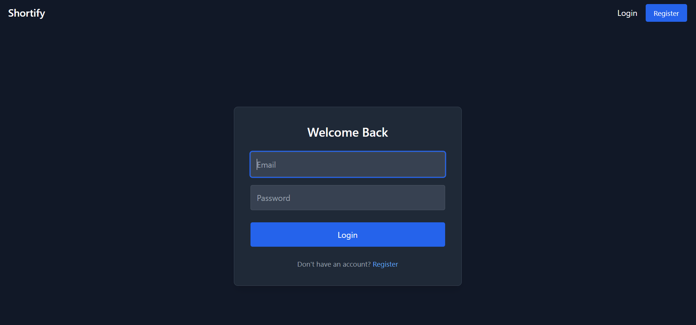
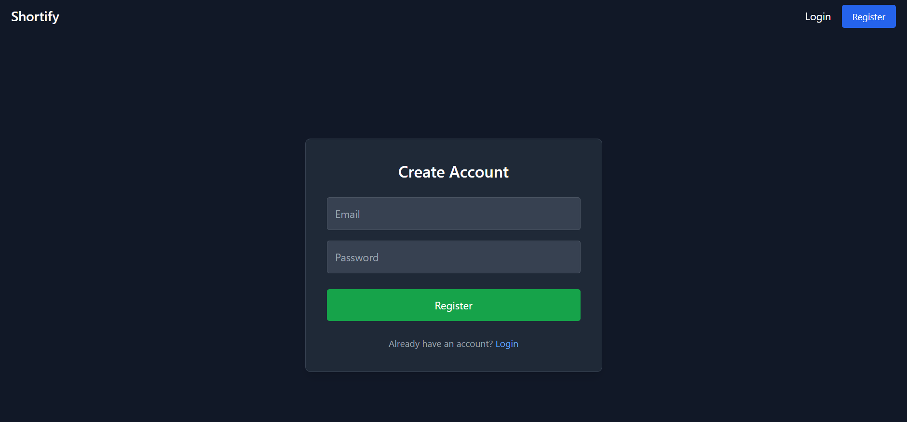
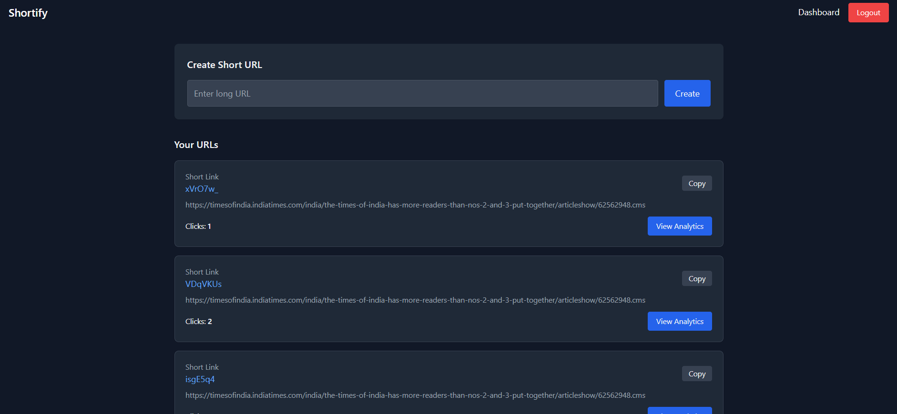
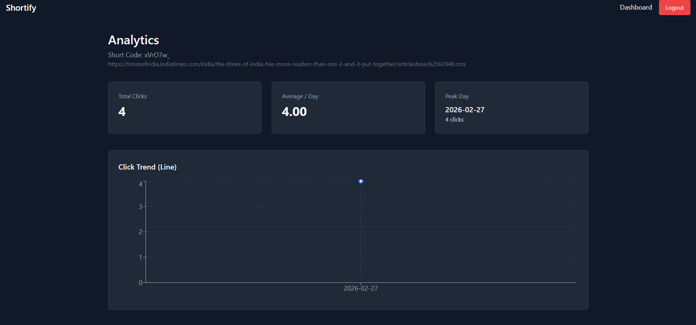

# 🔗 Shortify  
### Scalable URL Shortener with Analytics & Redis Caching

---

## 📌 Overview

**Shortify** is a full-stack URL shortening system designed with production-oriented backend architecture, Redis caching, and analytics aggregation.

This project focuses heavily on backend design decisions, scalability awareness, and clean architecture principles.

---

# 🚀 Tech Stack

---

## 🖥 Backend

- Node.js 20
- TypeScript
- Express 5
- PostgreSQL
- Prisma ORM
- Redis
- Docker & Docker Compose
- JWT Authentication
- bcrypt (password hashing)

---

## 🎨 Frontend

- React
- TypeScript
- Vite
- Tailwind CSS
- Recharts

---

# 🏗 System Architecture


Browser (React)
↓
Node.js API (Express + TypeScript)
↓
Redis (Cache Layer)
↓
PostgreSQL (Source of Truth)


---

## Backend Layered Architecture


Controller → Service → Repository → Prisma → PostgreSQL


- **Controllers** handle HTTP logic  
- **Services** contain business rules  
- **Repositories** manage data access  
- **Prisma** abstracts database communication  

This separation keeps the system modular, scalable, and maintainable.

---

# 🔐 Authentication

- JWT-based authentication  
- bcrypt password hashing  
- Protected routes middleware  
- Stateless design (supports horizontal scaling)

---

# 🔄 Redirect & Caching Strategy

## Cache Pattern Used  
**Cache-Aside (Lazy Loading)**

---

## Redirect Flow

1. Client requests `shortCode`
2. Check Redis cache
3. Cache hit → return `longUrl`
4. Cache miss → fetch from PostgreSQL
5. Store result in Redis (TTL: 1 hour)
6. Log click in `Click` table
7. Increment `clickCount`
8. Send `302` redirect

---

## Why Redis?

- Reduces database load  
- Improves redirect latency  
- Optimized for read-heavy workloads  

---

# 📊 Analytics Engine

Instead of storing only a click counter, a dedicated `Click` table is used.

This enables:

- Daily click aggregation  
- Peak day detection  
- Average click computation  
- Future extensibility (geo/IP analytics)

---

## Analytics Endpoints


GET /api/analytics/:shortCode
GET /api/analytics/user


---

## Analytics Returned

- Total clicks  
- Clicks grouped by date  
- URL metadata  

---

# 🗃 Database Design

---

## User

- id (PK)
- email (unique)
- passwordHash
- createdAt

---

## Url

- id (PK)
- shortCode (unique, indexed)
- longUrl
- clickCount
- expiryDate (optional)
- userId (FK)
- createdAt

---

## Click

- id (PK)
- urlId (indexed, cascade delete)
- ipAddress
- userAgent
- createdAt (indexed)

---

## Indexing Strategy

- `shortCode` indexed for fast redirect lookup  
- `userId` indexed for dashboard queries  
- `createdAt` indexed for time-based analytics  
- `urlId` indexed for efficient aggregation  

Designed for:

- Low-latency redirects  
- Efficient time-series queries  
- Scalable growth  

---

# 📸 Application Preview

---

## 🏠 Home


---

## 🔐 Login



---

## 📝 Register



---

## 📊 Dashboard



---

## 📈 Analytics


---

# 🐳 Infrastructure

Docker Compose services:

- PostgreSQL (port 5432)  
- Redis (port 6379)  

---

## Start Infrastructure

```bash
docker-compose up -d
🚀 Running Locally
Backend
cd backend
npm install
npx prisma migrate dev
npm run dev

Runs at:
http://localhost:3000

Frontend
cd frontend
npm install
npm run dev

Runs at:
http://localhost:5173

```

📈 Scalability Considerations
---
Stateless JWT authentication

Redis for high-frequency read optimization

Indexed schema for performance

Modular architecture for future microservice split

Dockerized environment for portability

Designed for horizontal scalability

🔮 Future Improvements
----
Custom short aliases

Geo-location analytics

Background analytics aggregation

Rate limiting per user

Soft delete support

Monitoring integration (Prometheus / Grafana)

CI/CD pipeline

🎯 What This Project Demonstrates
---
Backend system design thinking

Real-world caching implementation

Database modeling decisions

Clean architecture separation

Analytics aggregation logic

Production mindset

This is not just a CRUD application , it is a backend-oriented system design project with full-stack integration.

👨‍💻 Author
---
Chetan Narware
